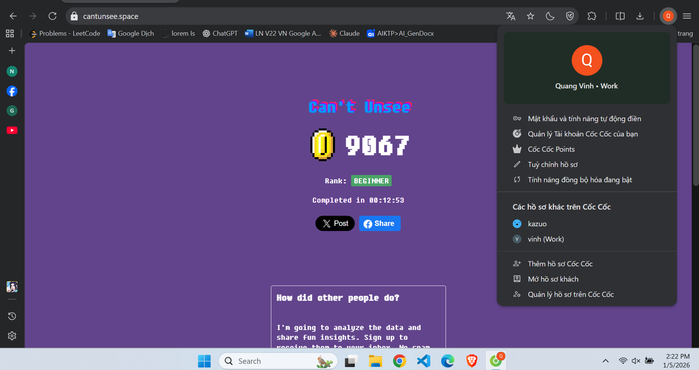
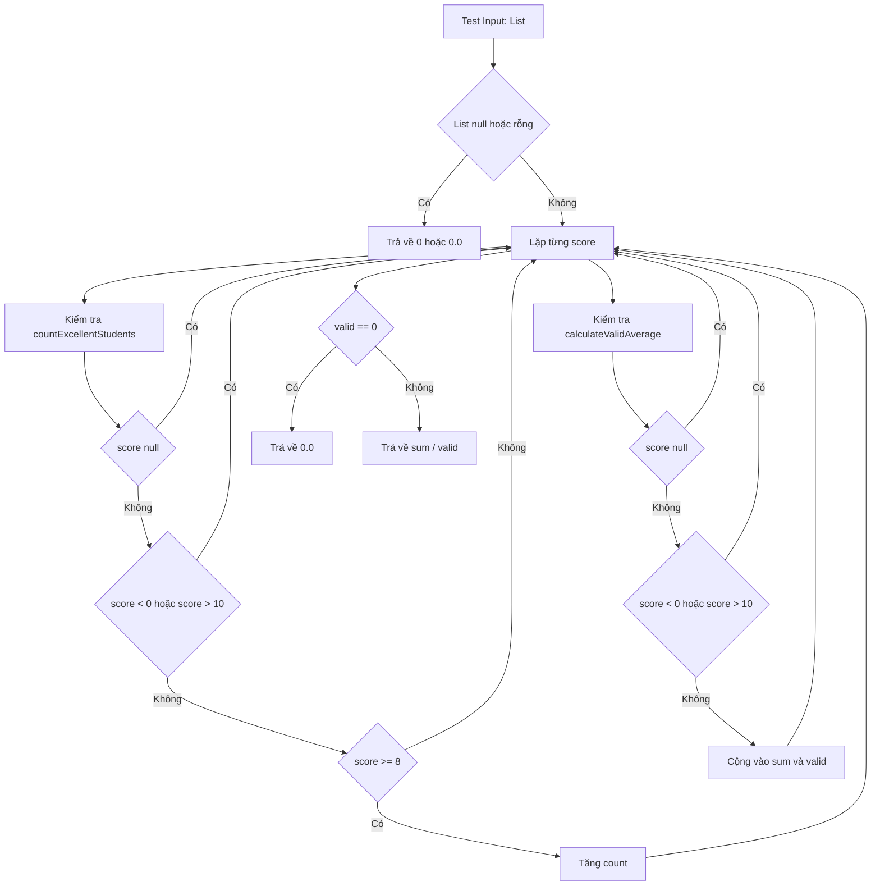

# Thực hành kiểm thử phần mềm

Dự án này phục vụ mục đích **thực hành và tổng hợp các kỹ thuật kiểm thử phần mềm**, bao gồm:
- Kiểm thử hộp đen bằng **bảng quyết định**
- Kiểm thử đơn vị cho chương trình Java
- Kiểm thử tự động giao diện người dùng bằng **Cypress**
- Kiểm thử hiệu năng hệ thống bằng **JMeter**

Dự án được tổ chức theo cấu trúc rõ ràng, phù hợp để nộp bài, báo cáo học phần và đánh giá thực hành.

---

## Mục tiêu dự án
- Hiểu và áp dụng quy trình kiểm thử phần mềm từ thủ công đến tự động
- Rèn luyện tư duy thiết kế ca kiểm thử
- Áp dụng kiểm thử hộp đen bằng bảng quyết định
- Thực hành kiểm thử đơn vị với JUnit 5 cho chương trình Java
- Thực hành kiểm thử giao diện người dùng bằng Cypress
- Thực hành kiểm thử hiệu năng hệ thống bằng JMeter
- Làm quen với quy trình quản lý mã nguồn trên GitHub

---

## Nội dung thực hành

### 1. Đánh giá giao diện người dùng
**Thời gian thực hiện:** 05/01

- Thực hành đánh giá giao diện người dùng thông qua trang:
  https://cantunsee.space/
- Phân tích các yếu tố:
  - Bố cục giao diện
  - Màu sắc
  - Tính dễ sử dụng
- Nhận diện các lỗi thiết kế giao diện thường gặp
- So sánh giao diện tốt và giao diện chưa tốt từ góc nhìn người dùng
  

---

### 2. Kiểm thử hộp đen bằng bảng quyết định

### 2.1 Giới thiệu
Phần này trình bày việc **áp dụng kỹ thuật kiểm thử hộp đen bằng bảng quyết định** nhằm:
- Phân tích đầy đủ các điều kiện đầu vào
- Xác định hành động tương ứng
- Thiết kế ca kiểm thử có tính bao phủ cao
- Ánh xạ trực tiếp sang các ca kiểm thử đơn vị

Đối tượng kiểm thử là các hàm xử lý dữ liệu trong lớp `StudentAnalyzer`.

---

### 2.2 Sơ đồ kiểm thử hộp đen

Sơ đồ dưới đây mô tả cách tiếp cận kiểm thử hộp đen, trong đó hệ thống được xem như một khối xử lý, chỉ quan tâm đến **đầu vào** và **đầu ra**, không xét đến cấu trúc bên trong.

---

### 2.3 Bảng quyết định cho hàm `countExcellentStudents(scores)`

#### 2.3.1 Yêu cầu chức năng (kiểm thử hộp đen)
Một điểm được tính là **xuất sắc** nếu thỏa mãn đồng thời các điều kiện:
- Không null
- 0 ≤ score ≤ 10
- score ≥ 8  

Các điểm không thỏa mãn các điều kiện trên sẽ **bị bỏ qua** và **không được đếm**.

---

#### 2.3.2 Điều kiện (Conditions)

| Ký hiệu | Điều kiện |
|------|----------|
| C1 | Danh sách rỗng hoặc null |
| C2 | score là null |
| C3 | score < 0 |
| C4 | score > 10 |
| C5 | score ≥ 8 |

---

#### 2.3.3 Hành động (Actions)

| Ký hiệu | Hành động |
|------|----------|
| A1 | Không đếm |
| A2 | Đếm là sinh viên xuất sắc |

---

#### 2.3.4 Bảng quyết định

| Điều kiện / Luật | R1 | R2 | R3 | R4 | R5 | R6 |
|------------------|----|----|----|----|----|----|
| C1: Danh sách null / rỗng | T | F | F | F | F | F |
| C2: score null | – | T | F | F | F | F |
| C3: score < 0 | – | – | T | F | F | F |
| C4: score > 10 | – | – | F | T | F | F |
| C5: score ≥ 8 | – | – | – | – | F | T |
| **Hành động** | | | | | | |
| A1: Không đếm | ✔ | ✔ | ✔ | ✔ | ✔ | |
| A2: Đếm | | | | | | ✔ |

---

#### 2.3.5 Ánh xạ với kiểm thử đơn vị

| Luật | Ca kiểm thử tương ứng |
|----|----------------------|
| R1 | shouldReturnZeroWhenListIsEmpty |
| R3 | shouldIgnoreScoreJustBelowZero |
| R5 | shouldIgnoreScoreJustBelowExcellentBoundary |
| R6 | shouldCountScoreAtExcellentBoundary |

---

### 2.4 Bảng quyết định cho hàm `calculateValidAverage(scores)`

#### 2.4.1 Yêu cầu chức năng (kiểm thử hộp đen)
- Chỉ sử dụng các điểm:
  - Không null
  - 0 ≤ score ≤ 10
- Nếu **không tồn tại điểm hợp lệ** → trả về **0.0**

---

#### 2.4.2 Điều kiện

| Ký hiệu | Điều kiện |
|------|----------|
| C1 | Danh sách null hoặc rỗng |
| C2 | score null |
| C3 | score < 0 |
| C4 | score > 10 |
| C5 | Tồn tại ít nhất một score hợp lệ |

---

#### 2.4.3 Hành động

| Ký hiệu | Hành động |
|------|----------|
| A1 | Trả về 0.0 |
| A2 | Tính trung bình các score hợp lệ |

---

#### 2.4.4 Bảng quyết định

| Điều kiện / Luật | R1 | R2 | R3 | R4 | R5 |
|------------------|----|----|----|----|----|
| C1: Danh sách null / rỗng | T | F | F | F | F |
| C2: score null | – | T | F | F | F |
| C3: score < 0 | – | – | T | F | F |
| C4: score > 10 | – | – | F | T | F |
| C5: Có score hợp lệ | – | – | F | F | T |
| **Hành động** | | | | | |
| A1: Trả về 0.0 | ✔ | ✔ | ✔ | ✔ | |
| A2: Tính trung bình | | | | | ✔ |

---

#### 2.4.5 Ánh xạ với kiểm thử đơn vị

| Luật | Ca kiểm thử đơn vị |
|----|-------------------|
| R1 | shouldReturnZeroWhenAverageListIsEmpty |
| R3 | shouldIgnoreScoreJustBelowZeroForAverage |
| R4 | shouldIgnoreScoreJustAboveUpperBoundaryForAverage |
| R5 | shouldCalculateAverageWithBoundaryValues |

---

### 2.5 Kết luận
Việc sử dụng **bảng quyết định trong kiểm thử hộp đen** giúp:
- Bao phủ đầy đủ các tổ hợp điều kiện
- Tránh thiếu sót ca kiểm thử quan trọng
- Dễ dàng ánh xạ sang kiểm thử đơn vị
- Nâng cao chất lượng và tính hệ thống của hoạt động kiểm thử

📁 Thư mục liên quan: `src`

---

### 3. Kiểm thử đơn vị chương trình Java
**Thời gian thực hiện:** 20/01

- Xây dựng chương trình phân tích điểm số học sinh
- Lớp xử lý chính: `StudentAnalyzer`
  - Đếm số học sinh giỏi (điểm ≥ 8.0)
  - Tính điểm trung bình hợp lệ
  - Loại bỏ dữ liệu không hợp lệ (điểm < 0 hoặc > 10)
- Viết ca kiểm thử cho:
  - Trường hợp hợp lệ
  - Trường hợp biên
  - Trường hợp dữ liệu sai
- Sử dụng JUnit 5 để kiểm thử tự động
- Lớp kiểm thử: `StudentAnalyzerTest`

📁 Thư mục liên quan:
- `src`
- `test`

---

### 4. Kiểm thử giao diện người dùng bằng Cypress
**Thời gian thực hiện:** 25/01

- Viết kịch bản kiểm thử tự động cho website giả lập
- Các chức năng được kiểm thử:
  - Đăng nhập
  - Thêm sản phẩm vào giỏ hàng
  - Thanh toán
- Mỗi chức năng được tách thành một kịch bản riêng

📁 Thư mục liên quan:

cypress-exercise/

└── cypress/e2e/

├── login_spec.cy.js

├── cart_spec.cy.js

└── checkout_spec.cy.js

---

### 5. Kiểm thử hiệu năng hệ thống bằng JMeter
**Thời gian thực hiện:** 26/01

- Thiết kế kịch bản kiểm thử hiệu năng cho website
- Thực hiện đo:
  - Thời gian phản hồi
  - Khả năng chịu tải
- Phân tích kết quả kiểm thử thông qua biểu đồ và hình ảnh

📁 Thư mục liên quan:

jmeter-exercise/

├── test-plan/

├── results/

├── results_1.png

├── results_2.png

└── results_3.png

---

## Công cụ và công nghệ sử dụng
- Java
- JUnit 5
- Maven
- Cypress
- JMeter
- Git và GitHub

---

## Yêu cầu môi trường
- Java phiên bản 11 trở lên
- Apache Maven
- Trình soạn thảo mã nguồn (IntelliJ IDEA, Eclipse hoặc Visual Studio Code)
- Trình duyệt hiện đại để chạy Cypress

---

## Cấu trúc thư mục dự án
software_testing

├── cypress-exercise

├── jmeter-exercise

├── src

│ ├── Bảng quyết định.docx

│ ├── Kiểm thử hộp đen.docx

│ └── StudentAnalyzer.java

├── test

│ └── StudentAnalyzerTest.java

└── README.md
